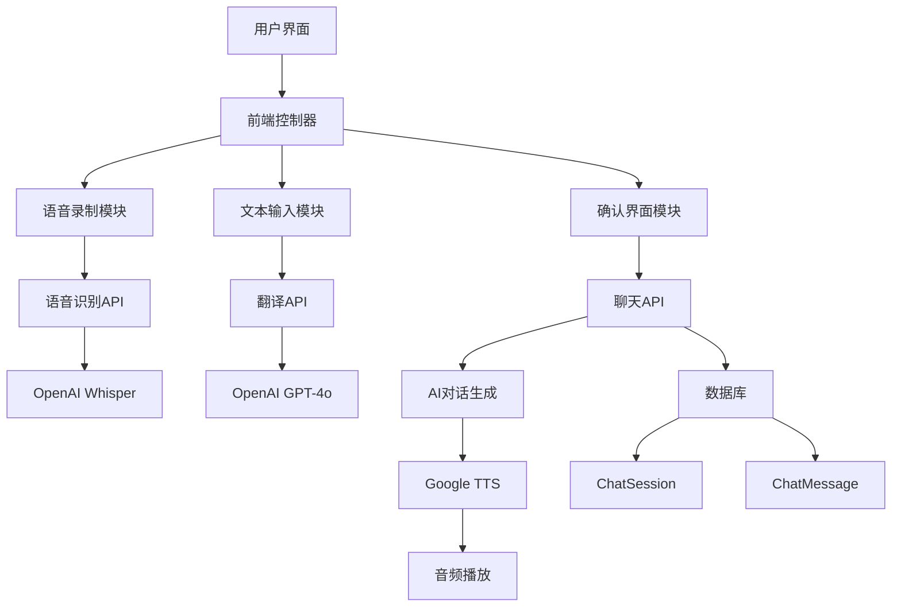

# 增强聊天交互功能设计文档

## 概述

本设计文档详细描述了speak_practice应用聊天交互功能的增强方案，通过集成语音识别、文本转语音、翻译等技术，为中文学习者提供更自然、更有效的口语练习体验。

## 架构

### 系统架构图



### 技术栈

- **前端**: JavaScript (ES6+), HTML5 Web Audio API, CSS3
- **后端**: Django 5.1, Python 3.x
- **语音识别**: OpenAI Whisper API
- **文本转语音**: Google Cloud Text-to-Speech API
- **AI对话**: OpenAI GPT-4o API
- **翻译**: OpenAI GPT-4o-mini API
- **数据库**: SQLite (现有ChatSession和ChatMessage模型)

## 组件和接口

### 1. 前端组件

#### 1.1 语音录制组件 (VoiceRecorder)
```javascript
class VoiceRecorder {
    constructor(options) {
        this.mediaRecorder = null;
        this.audioChunks = [];
        this.isRecording = false;
        this.onRecordingStart = options.onRecordingStart;
        this.onRecordingStop = options.onRecordingStop;
        this.onError = options.onError;
    }
    
    async startRecording() {
        // 获取麦克风权限并开始录音
    }
    
    stopRecording() {
        // 停止录音并返回音频数据
    }
    
    getAudioBlob() {
        // 返回录制的音频Blob
    }
}
```

#### 1.2 聊天界面组件 (ChatInterface)
```javascript
class ChatInterface {
    constructor(sessionId, apiEndpoints, csrfToken) {
        this.sessionId = sessionId;
        this.apiEndpoints = apiEndpoints;
        this.csrfToken = csrfToken;
        this.voiceRecorder = new VoiceRecorder({...});
        this.audioPlayer = new AudioPlayer();
    }
    
    addMessage(content, isUser) {
        // 添加消息到聊天界面
    }
    
    showConfirmation(transcribedText, englishTranslation) {
        // 显示确认界面
    }
    
    hideConfirmation() {
        // 隐藏确认界面
    }
    
    showStatus(message) {
        // 显示状态指示器
    }
    
    hideStatus() {
        // 隐藏状态指示器
    }
}
```

#### 1.3 音频播放组件 (AudioPlayer)
```javascript
class AudioPlayer {
    constructor() {
        this.audioElement = document.getElementById('tts-audio');
        this.isPlaying = false;
    }
    
    playBase64Audio(base64Data) {
        // 播放Base64编码的音频
    }
    
    stop() {
        // 停止播放
    }
    
    pause() {
        // 暂停播放
    }
}
```

### 2. 后端API接口

#### 2.1 语音转文本API
```python
@csrf_protect
@login_required
@require_http_methods(["POST"])
def transcribe_audio_api(request):
    """
    将用户录制的音频转换为中文文本
    
    输入:
    - audio: 音频文件 (multipart/form-data)
    
    输出:
    {
        "success": true,
        "chinese_text": "转录的中文文本",
        "english_translation": "英文翻译",
        "csrf_token": "新的CSRF令牌"
    }
    """
```

#### 2.2 文本翻译API
```python
@csrf_protect
@login_required
@require_http_methods(["POST"])
def translate_text_api(request):
    """
    将英文文本翻译为中文并生成TTS音频
    
    输入:
    {
        "text": "要翻译的英文文本"
    }
    
    输出:
    {
        "success": true,
        "chinese_text": "翻译的中文文本",
        "tts_audio": "Base64编码的音频数据",
        "csrf_token": "新的CSRF令牌"
    }
    """
```

#### 2.3 增强聊天API
```python
@csrf_protect
@login_required
@require_http_methods(["POST"])
def chat_api(request):
    """
    处理聊天消息并返回AI回复和TTS音频
    
    输入:
    {
        "message": "用户消息",
        "session_id": 会话ID
    }
    
    输出:
    {
        "success": true,
        "ai_response": {
            "chinese": "AI的中文回复",
            "pinyin": "拼音标注"
        },
        "tts_audio": "Base64编码的音频数据",
        "token_info": {
            "current_tokens": 当前令牌数,
            "max_tokens": 最大令牌数,
            "percentage_used": 使用百分比,
            "approaching_limit": 是否接近限制,
            "conversation_ended": 对话是否结束
        }
    }
    """
```

### 3. 服务层组件

#### 3.1 语音识别服务
```python
class SpeechRecognitionService:
    def __init__(self):
        self.openai_api_key = settings.OPENAI_API_KEY
        self.whisper_url = "https://api.openai.com/v1/audio/transcriptions"
    
    def transcribe_audio(self, audio_file):
        """
        使用OpenAI Whisper API转录音频
        
        参数:
        - audio_file: Django UploadedFile对象
        
        返回:
        - str: 转录的中文文本
        """
        
    def validate_audio_file(self, audio_file):
        """
        验证音频文件格式和大小
        """
```

#### 3.2 文本转语音服务
```python
class TextToSpeechService:
    def __init__(self):
        self.google_api_key = os.getenv('GOOGLE_API_KEY')
        self.tts_url = f"https://texttospeech.googleapis.com/v1/text:synthesize?key={self.google_api_key}"
    
    def generate_speech(self, text, language_code='cmn-CN'):
        """
        使用Google TTS生成语音
        
        参数:
        - text: 要转换的文本
        - language_code: 语言代码
        
        返回:
        - str: Base64编码的音频数据
        """
        
    def validate_text_length(self, text):
        """
        验证文本长度是否适合TTS
        """
```

#### 3.3 翻译服务
```python
class TranslationService:
    def __init__(self):
        self.openai_api_key = settings.OPENAI_API_KEY
        self.api_url = "https://api.openai.com/v1/chat/completions"
    
    def translate_text(self, text, source_lang='en', target_lang='zh'):
        """
        使用OpenAI GPT-4翻译文本
        
        参数:
        - text: 要翻译的文本
        - source_lang: 源语言
        - target_lang: 目标语言
        
        返回:
        - str: 翻译后的文本
        """
        
    def get_translation_prompt(self, text, target_lang):
        """
        生成翻译提示词
        """
```

## 数据模型

### 现有模型扩展

```python
# 扩展现有的ChatMessage模型以支持新的消息类型
class ChatMessage(models.Model):
    session = models.ForeignKey(ChatSession, on_delete=models.CASCADE, related_name='messages')
    sender_type = models.CharField(max_length=10, choices=[('user', 'User'), ('ai', 'AI')])
    message_content = models.JSONField()  # 现有字段，支持多种内容格式
    timestamp = models.DateTimeField(auto_now_add=True)
    
    # 新增字段用于支持语音消息
    audio_duration = models.FloatField(null=True, blank=True)  # 音频时长（秒）
    input_method = models.CharField(
        max_length=10, 
        choices=[('text', 'Text'), ('voice', 'Voice'), ('translation', 'Translation')],
        default='text'
    )
    
    class Meta:
        ordering = ['timestamp']
```

### 消息内容格式

```python
# 用户文本消息
{
    "chinese_text": "用户输入的中文文本",
    "input_method": "text"
}

# 用户语音消息
{
    "chinese_text": "转录的中文文本",
    "english_translation": "英文翻译",
    "input_method": "voice",
    "audio_duration": 3.5
}

# 用户翻译消息
{
    "chinese_text": "翻译的中文文本",
    "original_english": "原始英文文本",
    "input_method": "translation"
}

# AI回复消息
{
    "chinese": "AI的中文回复",
    "pinyin": "拼音标注",
    "tts_generated": true
}
```

## 错误处理

### 1. 语音识别错误处理

```python
class SpeechRecognitionError(Exception):
    pass

class AudioValidationError(SpeechRecognitionError):
    pass

class TranscriptionTimeoutError(SpeechRecognitionError):
    pass

def handle_speech_recognition_errors(func):
    def wrapper(*args, **kwargs):
        try:
            return func(*args, **kwargs)
        except AudioValidationError as e:
            return JsonResponse({
                'success': False,
                'error': 'Invalid audio file',
                'error_code': 'audio_validation_error'
            }, status=400)
        except TranscriptionTimeoutError as e:
            return JsonResponse({
                'success': False,
                'error': 'Speech recognition timeout',
                'error_code': 'transcription_timeout'
            }, status=408)
        except Exception as e:
            logger.error(f"Speech recognition error: {e}")
            return JsonResponse({
                'success': False,
                'error': 'Speech recognition failed',
                'error_code': 'transcription_error'
            }, status=500)
    return wrapper
```

### 2. TTS错误处理

```python
class TTSError(Exception):
    pass

class TTSQuotaExceededError(TTSError):
    pass

class TTSServiceUnavailableError(TTSError):
    pass

def handle_tts_errors(func):
    def wrapper(*args, **kwargs):
        try:
            return func(*args, **kwargs)
        except TTSQuotaExceededError as e:
            return JsonResponse({
                'success': False,
                'error': 'TTS quota exceeded',
                'error_code': 'tts_quota_exceeded'
            }, status=429)
        except TTSServiceUnavailableError as e:
            return JsonResponse({
                'success': False,
                'error': 'TTS service unavailable',
                'error_code': 'tts_service_unavailable'
            }, status=503)
        except Exception as e:
            logger.error(f"TTS error: {e}")
            return JsonResponse({
                'success': False,
                'error': 'TTS generation failed',
                'error_code': 'tts_error'
            }, status=500)
    return wrapper
```

### 3. 前端错误处理策略

```javascript
class ErrorHandler {
    static handleAPIError(error, context) {
        const errorHandlers = {
            'audio_validation_error': () => this.showError('请上传有效的音频文件'),
            'transcription_timeout': () => this.showError('语音识别超时，请重试'),
            'tts_quota_exceeded': () => this.showError('语音合成服务暂时不可用'),
            'network_error': () => this.showError('网络连接问题，请检查网络'),
            'default': () => this.showError('操作失败，请重试')
        };
        
        const handler = errorHandlers[error.error_code] || errorHandlers['default'];
        handler();
    }
    
    static showError(message) {
        // 显示用户友好的错误信息
    }
    
    static showRetryOption(retryCallback) {
        // 显示重试选项
    }
}
```

## 测试策略

### 1. 单元测试

```python
# tests/test_speech_recognition.py
class SpeechRecognitionServiceTest(TestCase):
    def setUp(self):
        self.service = SpeechRecognitionService()
        
    def test_transcribe_valid_audio(self):
        # 测试有效音频文件的转录
        
    def test_transcribe_invalid_audio_format(self):
        # 测试无效音频格式的处理
        
    def test_transcribe_oversized_audio(self):
        # 测试超大音频文件的处理

# tests/test_tts_service.py
class TextToSpeechServiceTest(TestCase):
    def setUp(self):
        self.service = TextToSpeechService()
        
    def test_generate_speech_chinese(self):
        # 测试中文文本的语音生成
        
    def test_generate_speech_empty_text(self):
        # 测试空文本的处理
        
    def test_generate_speech_long_text(self):
        # 测试长文本的处理
```

### 2. 集成测试

```python
# tests/test_chat_integration.py
class ChatIntegrationTest(TestCase):
    def setUp(self):
        self.user = User.objects.create_user('testuser', 'test@example.com', 'password')
        self.session = ChatSession.objects.create(user=self.user, scene='测试场景')
        
    def test_voice_message_flow(self):
        # 测试完整的语音消息流程
        
    def test_text_translation_flow(self):
        # 测试文本翻译流程
        
    def test_ai_response_with_tts(self):
        # 测试AI回复和TTS生成
```

### 3. 前端测试

```javascript
// tests/chat-interface.test.js
describe('ChatInterface', () => {
    let chatInterface;
    
    beforeEach(() => {
        chatInterface = new ChatInterface(1, mockApiEndpoints, 'csrf-token');
    });
    
    test('should record and transcribe audio', async () => {
        // 测试音频录制和转录
    });
    
    test('should handle transcription errors gracefully', async () => {
        // 测试转录错误处理
    });
    
    test('should play TTS audio automatically', async () => {
        // 测试TTS音频自动播放
    });
});
```

## 性能优化

### 1. 音频处理优化

- **音频压缩**: 在发送到API之前压缩音频文件
- **格式转换**: 统一使用WebM格式以减少文件大小
- **分块上传**: 对于长音频文件实现分块上传

### 2. TTS缓存策略

```python
from django.core.cache import cache
import hashlib

class TTSCacheService:
    def __init__(self):
        self.cache_timeout = 3600 * 24  # 24小时
        
    def get_cache_key(self, text, language_code):
        content = f"{text}:{language_code}"
        return f"tts:{hashlib.md5(content.encode()).hexdigest()}"
        
    def get_cached_audio(self, text, language_code):
        cache_key = self.get_cache_key(text, language_code)
        return cache.get(cache_key)
        
    def cache_audio(self, text, language_code, audio_data):
        cache_key = self.get_cache_key(text, language_code)
        cache.set(cache_key, audio_data, self.cache_timeout)
```

### 3. API调用优化

- **请求去重**: 防止重复的API调用
- **超时设置**: 合理设置API调用超时时间
- **重试机制**: 实现指数退避的重试策略

## 安全考虑

### 1. 音频文件安全

- **文件类型验证**: 严格验证上传的音频文件类型
- **文件大小限制**: 限制音频文件大小（最大10MB）
- **病毒扫描**: 对上传的文件进行安全扫描

### 2. API安全

- **速率限制**: 实现API调用速率限制
- **CSRF保护**: 所有API调用都需要CSRF令牌
- **输入验证**: 严格验证所有用户输入

### 3. 数据隐私

- **音频数据处理**: 音频数据仅用于转录，不存储在服务器
- **对话记录**: 敏感对话内容的加密存储
- **API密钥管理**: 安全管理第三方API密钥

## 部署考虑

### 1. 环境变量配置

```bash
# .env文件
OPENAI_API_KEY=sk-...
GOOGLE_API_KEY=...
GOOGLE_TTS_QUOTA_LIMIT=1000000
AUDIO_UPLOAD_MAX_SIZE=10485760  # 10MB
TTS_CACHE_TIMEOUT=86400  # 24小时
```

### 2. 静态文件配置

- **音频文件处理**: 配置适当的音频文件MIME类型
- **CDN集成**: 考虑使用CDN加速音频文件传输

### 3. 监控和日志

```python
import logging

# 配置专门的语音处理日志
speech_logger = logging.getLogger('speak_practice.speech')
tts_logger = logging.getLogger('speak_practice.tts')
translation_logger = logging.getLogger('speak_practice.translation')

# 性能监控
def log_api_performance(api_name, duration, success):
    performance_logger.info(f"{api_name}: {duration:.2f}s, success: {success}")
```